## 1. Обязательная часть: базовое решение и исследование параметров

### 1.1. Подготовка данных и базовая модель
На этапе предварительной обработки сгенерированная выборка (500 объектов) была разделена в пропорции 70/30 с сохранением баланса классов посредством стратификации.
* **Размер обучающей выборки:** 351 объект (распределение классов: 175 класса 0, 176 класса 1).
* **Размер тестовой выборки:** 149 объектов (распределение классов: 74 класса 0, 75 класса 1).

Базовое обучение проводилось со следующими параметрами: скорость обучения $\eta = 0.1$, размер батча = 32, количество эпох — 100.
* **Точность на обучении (Train Accuracy):** $0.8632$
* **Точность на тесте (Test Accuracy):** $0.9060$

  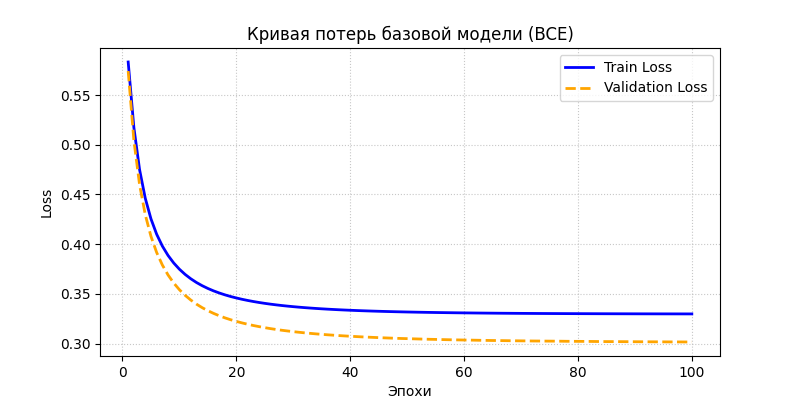
   
  <em>Рисунок 1: Зависимость значения функции потерь BCE от эпохи обучения на тренировочном и валидационном множествах</em>

  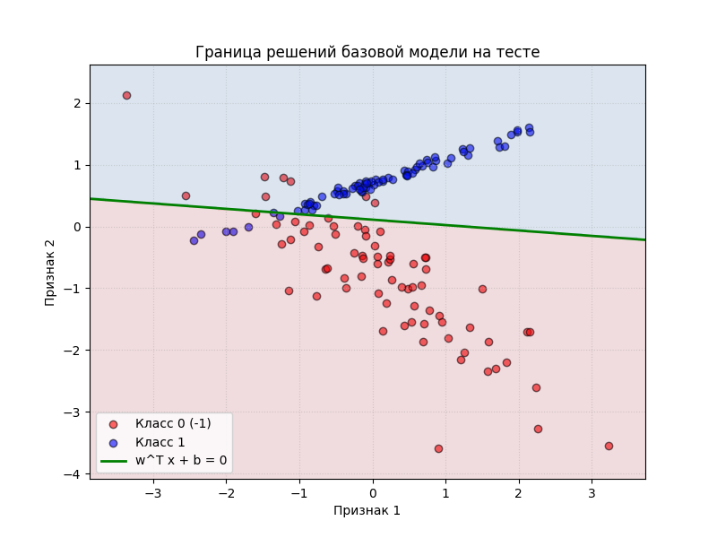
   
  <em>Рисунок 2: Разделяющая граница w^T x + b = 0 базовой модели на плоскости тестовых данных</em>

---

### 1.2. Влияние темпа обучения (Learning Rate)
Исследовалась скорость сходимости при фиксированном размере батча 32 на протяжении 100 эпох.

| Скорость обучения (lr) | Точность на обучении | Точность на тесте |
| :---: | :---: | :---: |
| **0.001** | $0.8604$ | $0.8993$ |
| **0.01** | $0.8547$ | $0.8926$ |
| **0.5** | $0.8575$ | $0.9060$ |
| **1.0** | $0.8604$ | $0.8993$ |

  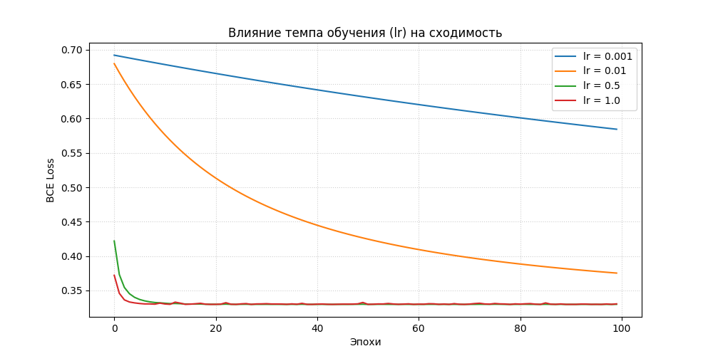
   
  <em>Рисунок 3: Сравнение скорости падения ошибки BCE для различных значений learning rate</em>

**Вывод:** При сверхмалом шаге ($\eta=0.001$) градиентный спуск не успевает достичь зоны оптимума за 100 эпох. При значениях $\eta \ge 0.5$ модель демонстрирует субсекундную сходимость к устойчивому минимуму без осцилляций.

---

### 1.3. Влияние размера батча (Batch Size)
Исследовалось влияние объема мини-батча при фиксированной скорости обучения $\eta = 0.1$.

| Размер батча (Batch Size) | Точность на обучении | Точность на тесте |
| :---: | :---: | :---: |
| **1 (Stochastic)** | $0.8632$ | $0.8993$ |
| **16** | $0.8632$ | $0.9060$ |
| **64** | $0.8575$ | $0.8993$ |
| **256** | $0.8604$ | $0.8993$ |

  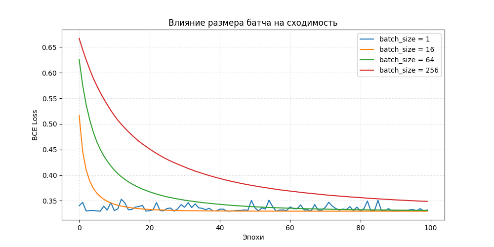
   
  <em>Рисунок 4: Траектории минимизации потерь для различных размеров мини-батча</em>

**Вывод:** Стохастический спуск (батч = 1) вызывает зашумленность и колебания траектории потерь. Крупный размер батча (256) сглаживает кривую, но замедляет скорость обучения по эпохам. Оптимальный показатель зафиксирован на значении батча 16.

---

### 1.4. Влияние метода инициализации весов
Исследовались три стратегии начального заполнения матрицы параметров.

| Метод инициализации | Точность на обучении | Точность на тесте |
| :--- | :---: | :---: |
| **Zeros (Нулевая)** | $0.8632$ | $0.9060$ |
| **Small Random ($\mathcal{N}(0, 1) \times 0.01$)** | $0.8632$ | $0.9060$ |
| **Large Random ($\mathcal{N}(0, 10)$)** | $0.8661$ | $0.8993$ |

**Вывод:** Так как оптимизационный ландшафт однослойного перцептрона является выпуклым, проблема симметрии отсутствует, и нулевая инициализация сходится к аналогичному оптимуму. Инициализация большими весами увеличивает время адаптации параметров, снижая итоговую обобщающую способность на тесте за 100 эпох.

---

## 2. Результаты выполнения дополнительных заданий

### 2.1. Нелинейные геометрические структуры
Модель была протестирована на различных распределениях данных, созданных собственным генератором.

  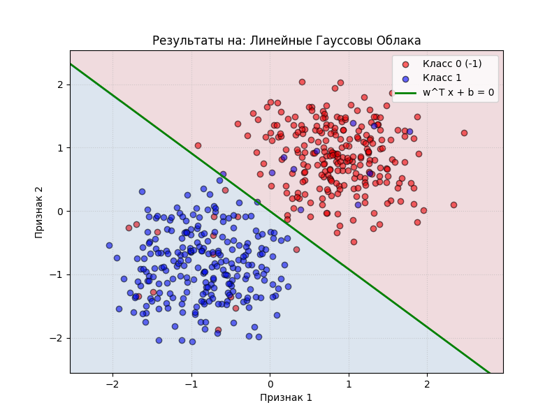
  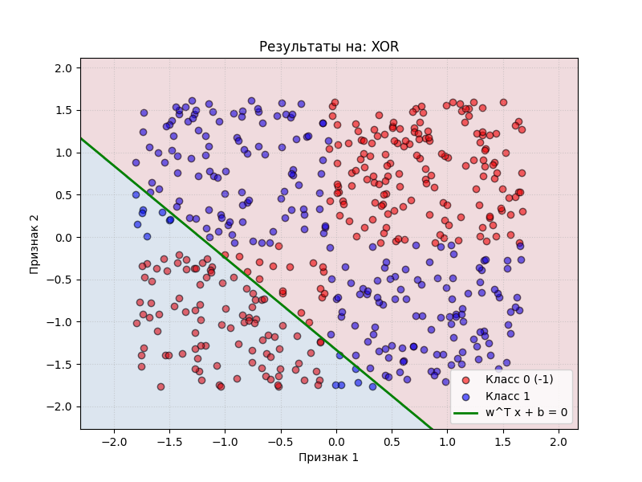
   
  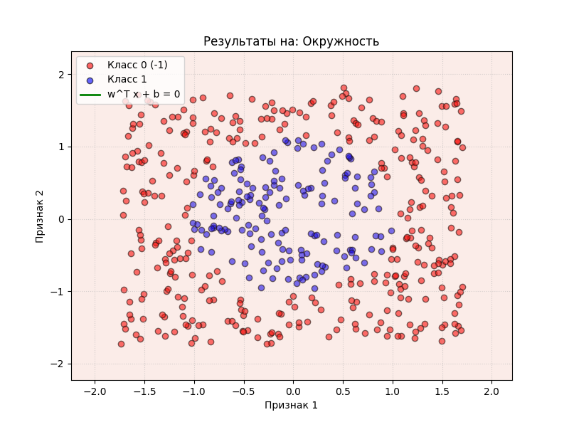
   
  <em>Рисунок 5: Границы решений перцептрона на линейном Гауссовом распределении, XOR  и Окружности</em>

**Вывод:** Однослойный перцептрон строит исключительно линейные границы решений. Он не способен корректно разделить нелинейные структуры XOR и Окружность.

---

### 2.2. Альтернативные функции потерь и L2-регуляризация

#### А. BCE vs Hinge Loss
Исследовалась динамика оптимизации при переходе к субградиентному спуску с Hinge Loss.

  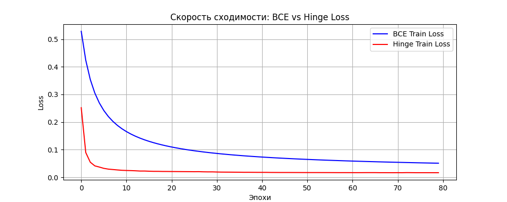
   
  <em>Рисунок 6: Кривые потерь при оптимизации через кросс-энтропию (BCE) и Hinge Loss</em>

**Вывод:** Hinge Loss сходится быстрее (за первые 5 эпох), поскольку отсекает вычисление градиентов для объектов, лежащих за границами единичного отступа.

#### Б. Влияние регуляризации на норму параметров
Зафиксировано изменение евклидовой нормы вектора весов $\|w\|_2$ при увеличении штрафа $\lambda$.

| Коэффициент L2 ($\lambda$) | Норма вектора весов ($\|w\|_2$) |
| :--- | :---: |
| **0.0 (Регуляризация отключена)** | $4.246756$ |
| **0.001** | $4.081504$ |
| **0.05** | $1.934552$ |
| **0.5** | $0.680812$ |

**Вывод:** С увеличением коэффициента регуляризации $\lambda$ веса принудительно стягиваются к нулю, что доказывает работоспособность алгоритма затухания весов (Weight Decay).

---

### 2.3. Метрики и анализ ошибок
Показатели модели, обученной на зашумленной выборке с уровнем искажения разметки $15\%$:
* **Precision (Точность):** $0.8289$
* **Recall (Полнота):** $0.8750$
* **F1-Score:** $0.8514$

  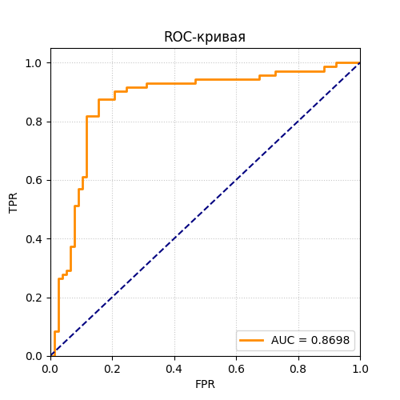
  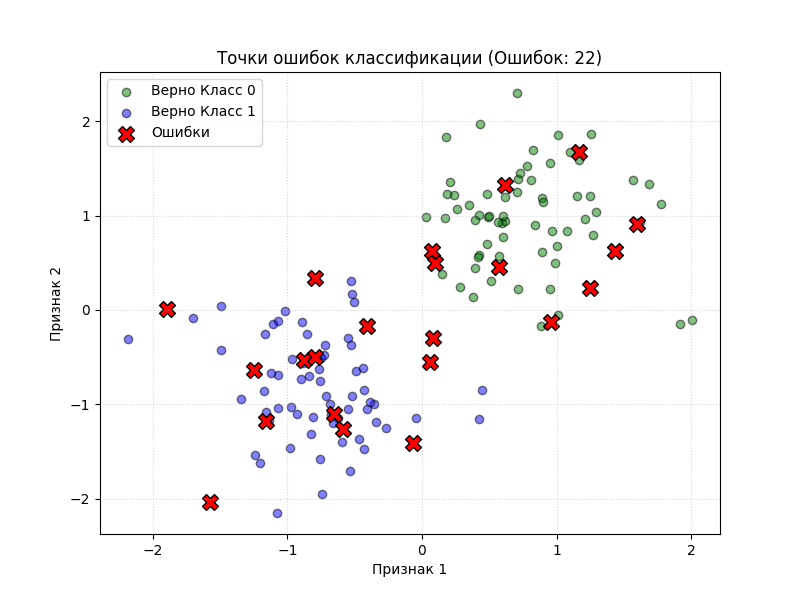
   
  <em>Рисунок 7: ROC-кривая с расчетом площади (слева) и визуальное распределение ошибочных точек вдоль границы решений (справа)</em>

---

### 2.4. Исследование сходимости Momentum SGD

  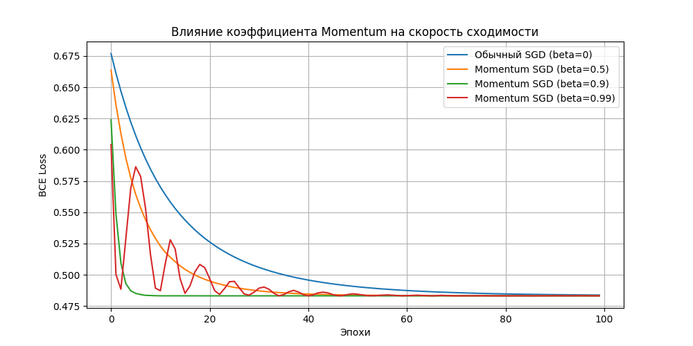
   
  <em>Рисунок 8: Траектории функции потерь при различных коэффициентах импульса beta</em>

**Вывод:** Метод импульса при оптимальном значении ($\beta=0.9$) ускоряет сходимость. Превышение порога ($\beta=0.99$) приводит к избыточной инерции параметров и появлению затухающих колебаний на графике.

---

### 2.5. Результаты кросс-валидации (5-Fold CV) и Grid Search

Ниже представлены средние оценки точности на валидационных фолдах при переборе параметров.

| Темп обучения (lr) | Размер батча (batch_size) | Средняя точность (Mean Acc) | Стандартное отклонение (Std Dev) |
| :---: | :---: | :---: | :---: |
| **0.005** | 16 | $0.8380$ | $0.0279$ |
| **0.005** | 32 | $0.8360$ | $0.0393$ |
| **0.005** | **64** | **0.8380** | **0.0349** |
| **0.05** | 16 | $0.8300$ | $0.0303$ |
| **0.05** | 32 | $0.8380$ | $0.0387$ |
| **0.05** | 64 | $0.8340$ | $0.0372$ |
| **0.2** | 16 | $0.8380$ | $0.0271$ |
| **0.2** | 32 | $0.8320$ | $0.0214$ |
| **0.2** | 64 | $0.8380$ | $0.0331$ |

* **Лучшие параметры:** `{'lr': 0.005, 'batch_size': 64}`
* **Точность на 5-кратной кросс-валидации:** $0.8380 \pm 0.0349$